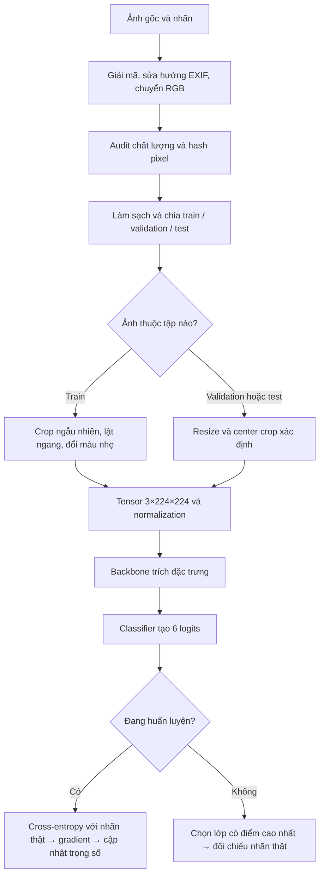

# Phân tích notebook Intel Image Classification

Notebook được phân tích: [intel_image_classification.ipynb](/home/anhpd/Project/Group/LapTrinhAIDS/CV/intel_image_classification.ipynb).

Phân tích dưới đây dựa trên việc đọc mã nguồn notebook. Luồng chính hợp lý, nhưng cần phân biệt giữa **huấn luyện được**, **đánh giá đúng**, và **đủ bằng chứng để kết luận**. File notebook hiện tại đã xóa outputs, nên chưa có số liệu full training trong file để kết luận chất lượng thực tế.

## 1. Notebook giải quyết bài toán gì?

Đây là bài toán **phân loại cảnh trong ảnh bằng học có giám sát**:

- Đầu vào: một ảnh RGB.
- Đầu ra: một trong sáu lớp `buildings`, `forest`, `glacier`, `mountain`, `sea`, `street`.
- Khi huấn luyện, mỗi ảnh có nhãn thật để mô hình học từ sai số dự đoán.

Ví dụ, một ảnh có núi tuyết và sông băng được đưa vào mô hình; mô hình phải chọn lớp phù hợp trong sáu lớp trên. Những cảnh chứa đồng thời nhiều yếu tố cũng là nguồn gây nhầm lẫn.

Notebook tổ chức **hai bài thực nghiệm độc lập**: MobileNetV3-Small và ViT-B/16. Trong mỗi bài, nó trả lời:

1. Sau giai đoạn chỉ học classifier, fine-tuning toàn bộ mô hình có cải thiện validation macro-F1 không?
2. Checkpoint được chọn phân loại test tốt đến đâu, và thường nhầm lớp nào?

Kết quả bàn giao của một lần chạy gồm trọng số mô hình, lịch sử huấn luyện, metrics, dự đoán từng ảnh, biểu đồ và kết luận có số liệu. “Caption” ở đây là **nhận xét dưới biểu đồ**, được sinh từ metrics thực tế.

## 2. Một ảnh đi qua pipeline như thế nào?



### 2.1. Đọc và kiểm tra ảnh

Hàm `decode_image()` giải mã ảnh, sửa hướng theo EXIF và chuyển sang RGB. Audit ghi lại kích thước, tỷ lệ khung hình, chế độ màu, độ sáng, độ tương phản và chỉ số Laplacian.

Ảnh còn được tính hash từ **kích thước và pixel RGB**. Hash phục vụ phát hiện bản sao chính xác, không phải đặc trưng đưa vào mô hình.

Trước khi chia validation, notebook:

- Loại ảnh không đọc được hoặc có nhãn không hợp lệ.
- Loại ảnh train trùng chính xác với test.
- Giữ một ảnh trong nhóm train trùng nhau và cùng nhãn.
- Loại nhóm train trùng nhau nhưng có nhãn mâu thuẫn.

Sau đó, 20% tập phát triển được tách thành validation bằng stratification.

### 2.2. Biến đổi ảnh tùy mục đích

Nếu ảnh thuộc **train**, mỗi lần được lấy ra có thể có diện mạo hơi khác:

- `RandomResizedCrop`: chọn vùng có diện tích khoảng 80–100% ảnh rồi đưa về 224×224.
- Lật ngang ngẫu nhiên.
- Thay đổi nhẹ độ sáng, tương phản, độ bão hòa và màu.

Mục đích là giúp mô hình học đặc trưng của cảnh, giảm việc ghi nhớ đúng một bố cục hoặc điều kiện ánh sáng.

Nếu ảnh thuộc **validation/test**, biến đổi phải xác định để việc đánh giá ổn định. Notebook dùng preprocessing của bộ pretrained weights: MobileNet resize cạnh ngắn về 256 rồi center crop 224; ViT resize về 256 rồi center crop 224. Xem [tài liệu MobileNetV3](https://docs.pytorch.org/vision/stable/models/generated/torchvision.models.mobilenet_v3_small.html) và [tài liệu ViT-B/16](https://docs.pytorch.org/vision/stable/models/generated/torchvision.models.vit_b_16.html).

Sau biến đổi, ảnh thành tensor `[3, 224, 224]`. Một batch đầy có dạng `[16, 3, 224, 224]`.

`ToTensor()` đưa giá trị pixel về khoảng 0–1; `Normalize()` biến đổi từng kênh theo:

```text
x_normalized = (x - mean) / std
```

Các mean/std ở đây theo ImageNet. Đây là cách đưa dữ liệu về thang đo mà pretrained model đã được huấn luyện với; không phải tăng độ sắc nét của ảnh.

### 2.3. Ảnh chạy qua mô hình

- **MobileNetV3:** các lớp convolution học và tổng hợp những mẫu thị giác như cạnh, kết cấu, hình dạng và bố cục. Classifier dùng biểu diễn cuối để tạo sáu điểm số.
- **ViT-B/16:** ảnh 224×224 được chia thành 196 patch kích thước 16×16. Thêm một class token thành 197 token; self-attention học quan hệ giữa các vùng ảnh. Biểu diễn class token được đưa vào classifier.

Đầu ra là sáu **logits**, chưa phải xác suất. Khi đánh giá, notebook dùng softmax để ghi xác suất và `argmax` để chọn lớp.

Nếu đang train, nhãn thật được dùng để tính loss và cập nhật trọng số. Nếu đang đánh giá, nhãn thật chỉ dùng để chấm kết quả, không được đưa vào mô hình.

## 3. Transfer learning được thực hiện ra sao?

**Backbone** là phần tạo biểu diễn đặc trưng của ảnh. **Classifier** ánh xạ biểu diễn đó thành sáu lớp cần học.

Notebook lấy mô hình đã học trên ImageNet, thay lớp đầu ra và huấn luyện theo hai giai đoạn:

| Nội dung | Giai đoạn classifier | Giai đoạn fine-tuning |
|---|---|---|
| Phần được cập nhật | Classifier | Toàn bộ mô hình |
| Backbone | Đóng băng, giữ `eval()` | Mở trọng số, chuyển `train()` |
| Số epoch mặc định | 3 | Tối đa 15 |
| Learning rate classifier | `1e-3` | `1e-4` |
| Learning rate backbone | Không cập nhật | `1e-5` |
| Điểm bắt đầu | Pretrained backbone, đầu ra mới | Checkpoint classifier tốt nhất |
| Chọn checkpoint | Validation macro-F1 cao nhất | Validation macro-F1 cao nhất |

Giai đoạn đầu giúp classifier học cách sử dụng đặc trưng sẵn có. Giai đoạn sau cho phép các đặc trưng đó thích nghi với dữ liệu cảnh, với learning rate backbone nhỏ để hạn chế thay đổi quá mạnh kiến thức pretrained.

Một chi tiết cần hiểu đúng: ở MobileNet, code mở **toàn bộ `model.classifier`**, gồm cả lớp tuyến tính có sẵn và lớp đầu ra mới. Nó không chỉ train riêng lớp sáu đầu ra. Với ViT, classifier là `heads.head`.

Đóng băng trọng số bằng `requires_grad=False` cũng chưa đủ để khóa toàn bộ hành vi backbone. BatchNorm có running statistics có thể thay đổi trong train mode. Vì vậy, việc giữ backbone ở `eval()` trong giai đoạn classifier là đúng.

Sau hai giai đoạn, notebook chọn checkpoint có validation macro-F1 cao hơn; nếu bằng nhau, chọn classifier. **Test được đánh giá sau lựa chọn này.**

## 4. Các kỹ thuật còn lại có ý nghĩa gì?

| Kỹ thuật | Ý nghĩa trong notebook |
|---|---|
| **EDA** | Hiểu phân bố dữ liệu, phát hiện bất thường và tìm bằng chứng cho đề xuất preprocessing. |
| **Stratification** | Giữ tỷ lệ sáu lớp tương đối tương đồng giữa train và validation. |
| **Cross-entropy** | Phạt mô hình khi phân bố dự đoán không phù hợp nhãn thật; đặc biệt phạt mạnh dự đoán sai nhưng tự tin. Code đưa logits trực tiếp vào loss là đúng. |
| **AdamW và weight decay** | AdamW điều chỉnh bước cập nhật theo gradient; weight decay giúp hạn chế trọng số phát triển quá lớn. |
| **Cosine decay** | Giảm learning rate trong từng giai đoạn để các cập nhật cuối nhỏ hơn. Code hiện tại không có learning-rate warm-up tăng dần. |
| **Gradient accumulation** | Cộng gradient từ hai batch 16 ảnh trước một lần cập nhật, để mỗi cửa sổ đầy dùng gradient của 32 ảnh mà giảm nhu cầu VRAM. |
| **AMP và GradScaler** | Dùng độ chính xác hỗn hợp khi có CUDA, thường giúp giảm bộ nhớ và tăng tốc; scaler hỗ trợ tránh gradient quá nhỏ trong FP16. |
| **Gradient clipping** | Giới hạn norm gradient ở 1 để giảm những bước cập nhật quá lớn. |
| **Early stopping** | Dừng fine-tuning sau bốn epoch liên tiếp không cải thiện validation macro-F1. |
| **Checkpoint và RNG** | Lưu mô hình tốt nhất; lưu thêm optimizer, scheduler, scaler và trạng thái ngẫu nhiên để tiếp tục sau khi bị ngắt. |
| **Smoke test** | Chạy dữ liệu ít và một epoch mỗi giai đoạn để kiểm tra kỹ thuật. Không đủ để đánh giá chất lượng mô hình. |

OpenCV trong notebook dùng để đo chất lượng ảnh. Độ sáng là trung bình grayscale; tương phản là độ lệch chuẩn; variance of Laplacian phản ánh mức biến thiên của cạnh. **Ảnh đưa vào mô hình vẫn là RGB.**

Laplacian thấp không tự chứng minh ảnh bị mờ: một vùng biển hoặc bầu trời ít kết cấu cũng có thể có giá trị thấp. Notebook chỉ đề xuất kiểm tra và thử nghiệm, không tự xóa ảnh tối/mờ hay tự áp dụng CLAHE. Cách này hợp lý.

## 5. Đọc kết quả để trả lời câu hỏi như thế nào?

Các metrics có vai trò khác nhau:

- **Accuracy:** tỷ lệ dự đoán đúng trên toàn bộ ảnh.
- **Precision từng lớp:** trong những ảnh được dự đoán thuộc lớp đó, bao nhiêu ảnh đúng?
- **Recall từng lớp:** trong những ảnh thật sự thuộc lớp đó, mô hình nhận ra bao nhiêu?
- **Macro-F1:** tính F1 cho từng lớp rồi lấy trung bình; sáu lớp có trọng số ngang nhau.
- **Weighted-F1:** lấy trung bình F1 theo số ảnh của từng lớp.

Notebook chọn checkpoint bằng macro-F1 để không chỉ ưu tiên những lớp có nhiều ảnh.

Đối với câu hỏi fine-tuning, nó tính:

```text
Δ (điểm phần trăm) = 100 × (F1_fine-tuning - F1_classifier)
```

Ví dụ **minh họa**, 0,80 → 0,84 là tăng **4 điểm phần trăm**, không phải tăng tương đối 4%.

Đối với câu hỏi chất lượng cuối, nó đánh giá cùng checkpoint trên train, validation và test bằng preprocessing xác định. Điều này giúp đọc khoảng cách train–validation hợp lý hơn so với đường học, nơi train còn augmentation và dropout.

Confusion matrix có hàng là nhãn thật, cột là dự đoán. Ô ngoài đường chéo cho biết lỗi theo hướng cụ thể, chẳng hạn `glacier → mountain`. Notebook báo ô lỗi lớn nhất kèm số lượng và tỷ lệ trong lớp thật.

Bước 11 tổng kết các mô hình đã chạy bằng `print()`. Các caption và kết luận lấy số liệu từ kết quả chạy, không điền sẵn thành tích.

## 6. Những chỗ cần sửa hoặc cần thận trọng

### 6.1. Câu hỏi fine-tuning hiện có yếu tố gây nhiễu

Classifier được học tối đa ba epoch, còn fine-tuning được học thêm tối đa 15 epoch, đồng thời thay learning rate và chế độ backbone. Nếu kết quả tăng, chưa thể quy toàn bộ mức tăng cho **việc mở trọng số backbone**.

Kết luận phù hợp hiện tại là: “Recipe fine-tuning đạt validation macro-F1 cao hơn recipe classifier trong lần chạy này.” Muốn xác định riêng tác động mở backbone, cần một nhánh đối chứng tiếp tục đóng băng backbone và học thêm với ngân sách tương đương.

### 6.2. Có một trường hợp lỗi resume từ CPU sang GPU

Trong `fit_one_stage()`, code luôn nạp trạng thái GradScaler. Checkpoint lưu trên CPU có scaler bị tắt nên trạng thái rỗng; nếu tiếp tục **một giai đoạn chưa hoàn tất** trên GPU với AMP bật, scaler có thể báo lỗi khi nạp.

Đây là nhận định từ mã nguồn, chưa phải lỗi được tái hiện bằng chạy notebook trong lần phân tích này. Cần xử lý scaler rỗng khi thay đổi chế độ AMP. Xem [mã nguồn GradScaler của PyTorch](https://github.com/pytorch/pytorch/blob/main/torch/amp/grad_scaler.py).

### 6.3. Smoke test chưa chứng minh chắc chắn backbone weights đã cập nhật

`backbone_digest()` hash cả parameters và buffers. Trong fine-tuning MobileNet, BatchNorm running statistics có thể đổi và khiến hash đổi, dù phép kiểm tra đó chưa xác nhận trọng số đã đổi. Nên kiểm tra riêng ít nhất một backbone parameter có thay đổi.

### 6.4. Effective batch 32 không hoàn toàn giống batch vật lý 32

Gradient được tích lũy qua 32 ảnh, nhưng BatchNorm của MobileNet vẫn xử lý từng batch vật lý 16 ảnh. Accumulation vẫn hữu ích; chỉ cần tránh giải thích rằng hai cách chạy tương đương hoàn toàn.

### 6.5. Chống rò rỉ hiện chỉ bao phủ bản sao chính xác

Hash pixel không bắt được ảnh gần giống sau resize, nén JPEG hoặc crop. Test cũng giữ bản sao nội bộ và có báo số lượng. Vì vậy, số ảnh test có thể lớn hơn số mẫu thực sự độc lập; chưa nên diễn giải một chênh lệch nhỏ là kết quả chắc chắn.

### 6.6. Crop là một lựa chọn cần kiểm chứng trên ảnh cảnh

Crop có thể bỏ đường chân trời, con đường hoặc vùng sông băng mang thông tin phân loại. Nó là augmentation hợp lý để thử, nhưng chưa có bằng chứng rằng cấu hình này tối ưu. Upsample về 224×224 cũng không tạo thêm chi tiết từ ảnh nhỏ.

### 6.7. Một số phần có thể rút gọn

- Với sáu lớp đều có mặt, balanced accuracy và macro-recall đang cung cấp cùng giá trị.
- `best.pt` sao chép checkpoint tốt nhất đã có, tạo thêm một bản trọng số.
- Phép cố tình sửa trọng số rồi reload để kiểm chứng checkpoint chạy cả trong full run; có thể chuyển sang smoke test.
- Kết luận ở cuối mỗi phần rồi được in lại ở bước 11.
- Grid ảnh lỗi lấy 12 lỗi đầu tiên bằng `.head(12)`; đó là ví dụ, chưa phải mẫu đại diện cho toàn bộ lỗi.

Các phần lưu checkpoint, resume và kiểm chứng có ích cho chạy lâu trên Colab/Kaggle, nhưng làm notebook khá nặng đối với người mới. Khi học, nên theo thứ tự **ảnh → tensor → logits → loss → gradient → validation → checkpoint → test**, rồi mới tìm hiểu hạ tầng resume.

### 6.8. Giới hạn của kết luận thực nghiệm

Một lần chạy seed 42 chỉ cho kết luận của lần chạy đó. Khoảng cách train–validation lớn là tín hiệu cần xem xét cùng đường học và lỗi từng lớp; nó chưa tự chứng minh overfitting hay nhãn sai.
